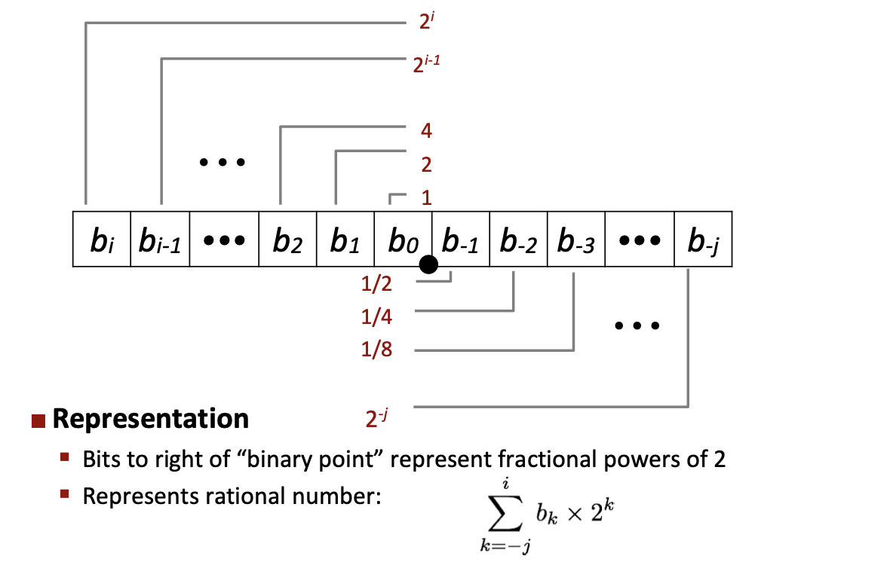
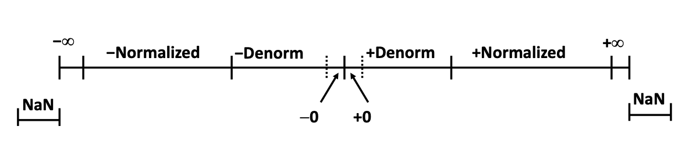

## Section Two - Floating Points

### Fractional Number Representation

- **Graph Illustration:**
  
  

- **Examples:**
  - 23/4 = 101.11 = 4 + 1 + 1/2 + 1/4
  - 23/8 = 10.111 = 2 + 1/2 + 1/4 + 1/8

  - **Rules:**
    - Divide by 2 = shift right
    - Multiply by 2 = shift left
    - 0.1111111... = 1/2 + 1/4 + 1/8 + ... -> 1.0 (converge) = 1.0 - ε

- **Limitations:**
  - 1#: Can only exactly represent x/2^k
    - 1/3 -> 0.01010101[01]...
  - 2#: Just one setting of binary point within the w bits

### IEEE Floating Point

- **IEEE Floating Point Basic:**
  - **IEEE Standard 754:** supported by all major CPUs
  - Driven by numerical concerns: overflow, underflow, rounding

- **Floating Point Representation**

  - **Numerical Form & Encoding**
    - Numerical Form: **v = (-1)s M 2E**
    - Example: 15213 = (-1)s x 1.1101101101101 x 213
      | Numerical Form           | Encoding    |
      |--------------------------|-------------|
      | sign bit s               | MSB s       |
      | Significant M [1.0, 2.0) | frac field  |
      | exponent E               | E exp field |

  - **Precision Options**
    1. Single Precision: 32 bits ~ 7 decimal digits
       - 1(s) | 8(exp) | 23(frac)
    2. Double Precision: 64 bits ~ 16 decimal digits
       - 1(s) | 11(exp) | 52(frac)
    3. Other formats: half precision, quad precision

  - **Three Kinds of Floating Point Numbers** (exp)
    1. **Denormalized** `(exp = 0)`
       - E = 1 - Bias
       - M with implied leading 0: M = 0.xxx...x (bits of frac)
       - Cases:
         - Case 1#: exp = 0 and frac = 0 `represent 0 values`
         - Case 2#: exp = 0 and frac ≠ 000...0 `numbers closest to 0.0`

    2. **Normalized** `(exp ≠ 0 and exp ≠ 11...11)`
       - Rule 1#: Exponent coded as a biased value: `E = exp (unsigned) - Bias`
         - Bias = 2k-1 - 1
         - Single precision: 127 (exp: 1...254, E: -126...127) 
         - Double precision: 1023 (exp: 1...2046, E: -1022...1023)
       - Rule 2#: M with implied leading 1: `M = 1.xxx...x`
         - Minimum when **frac** = 000...0 (M = 1.0)
         - Maximum when **frac** = 111...1 (M = 2.0 – ε)
       - Example: `float F = 15213.0 = 1.1101101101101 * 2^13`
         - Significand:
           - M = 1.**1101101101101**
           - frac = **1101101101101**0000000000
         - Exponent
           - E = 13, Bias = 127, exp = 140 = 10001100
         - Result: **0** **10001100** **11011011011010000000000**

    3. **Special Values** `(exp = 111...1)`
       - Case 1#: exp **=** 111...1, frac **=** 000...0 `(+inf/-inf)`
       - Case 2#: exp = 111...1, frac ≠ 000...0 `(NaN)`

- **C Float Decoding Example**

  - **Float**: `0xC0A00000` 

  - **Encoding**:
    - Binary: `1100 0000 1010 0000 0000 0000 0000 0000`
    - Binary Bits: `(s)1 | (exp)1000 0001 | (frac) 010 0000 0000 0000 0000`

  - **Numerical**:
    - E = exp - bias = 129 - 127 = 2
    - M = 1.010....0 = 1 + 1/4 = 1.25
    - S = 1 

  - **Calculation**: **v = (-1)1 * 1.25 * 22 = -5**

- **Visualization: Floating Point Encodings**
  
  
