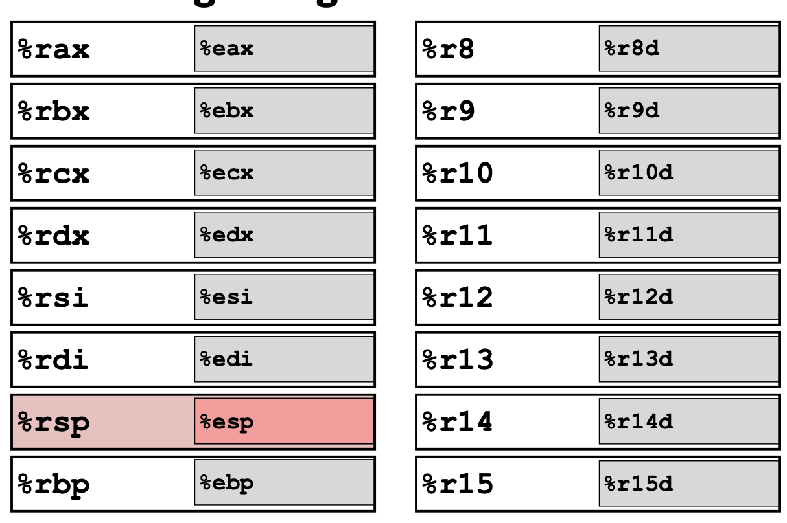
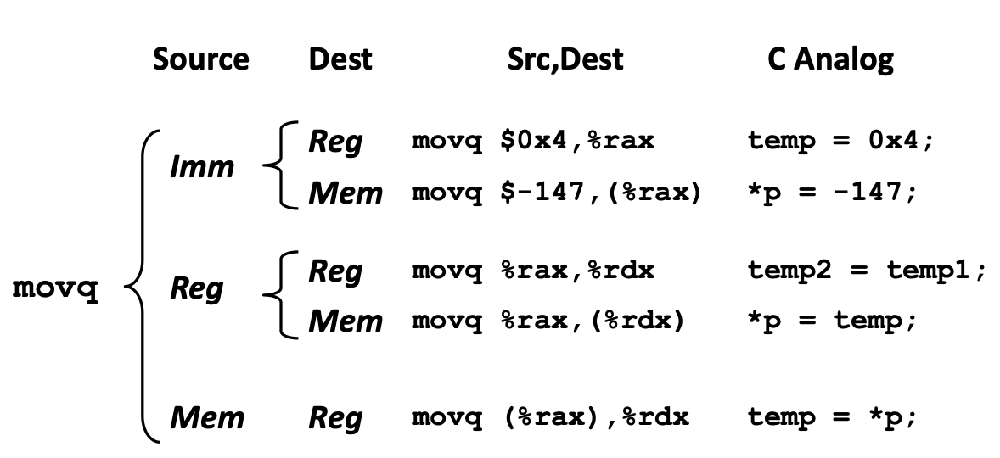
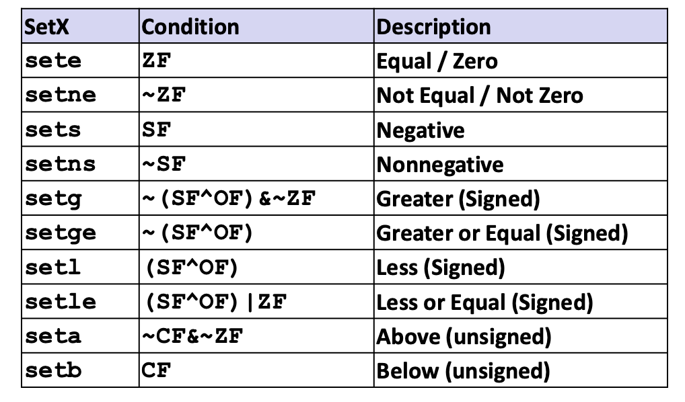
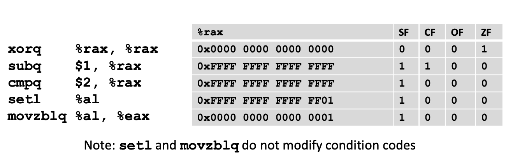

## 1.  Basic

### 1.1. Assembly Basics: Register, operands, move

- **<u>Levels of Abstraction</u>**

  - **C code**

  - **Assembly programmer**  
      
    <br clear="left"/>

  - **Computer designer**
    - caches, clock freq, layout, ...

- **<u>Definitions</u>**

  - **Architecture** (ISA, Instruction Set Architecture)
    - Machine Code: The byte-level programs that a processor executes
    - Assembly Code: A text representation of machine code
    - Example: Intel (x86, x86-64), ARM

  - **Microarchitecture**: Implementation of Architecture
    - Examples: cache sizes, core frequency


​      

- **<u>Assembly Characteristics: Data Types</u>**

  - Integer data of 1, 2, 4, or 8 bytes
  - Floating point data of 4, 8, or 10 bytes
  - No aggregate types such as arrays or structures


- **<u>x86-64 Integer Registers</u>**  `%esp: lower 4 bytes`

  
  <br clear="left"/>


- **<u>Assembly Characteristics: Operations</u>**

  - **Transfer data** between memory and register

    - **Moving Data:**

      - `movq Source, Dest`

        -  `q` = 8 bytes
        - <u>Operand 1#</u> - Immediate - Constant Integer Data - `$0x400, $-533` - `1, 2, or 4 bytes`
        - <u>Operand 2#</u> - Register - One of 16 Integer Register - `%rax`
        - <u>Operand 3#</u> - Memory -  `(%rax)`

      - `movq` operand combination (cannot do memory-memory transfer with a signle instruction)

        
        <br clear="left"/>

        

  - Perform **arithmetic function** on register or memory data

  - **Transfer control**: unconditional jumps, conditional & indirect branches


- **<u>Examples of Addressing Modes</u>**

  ```c
  void swap(long *xp /*%rdi*/, long *yp /*%rsi*/) { 
    long t0 = *xp;
    long t1 = *yp;
    *xp = t1;
    *yp = t0;
  }
  
  // Assembly:
  swap:
    movq (%rdi), %rax 
    movq (%rsi), %rdx 
    movq %rdx, (%rdi) 
    movq %rax, (%rsi) 
    ret
  ```


- **<u>Memory Addressing Modes</u>**

  - **Rules**:

    - Normal - `(R)` - `Mem[Reg[R]]`
    - D - Displacement 
    - Rb - Base Register (Any of 16 integer registers)
    - Ri - Index Register (Any, except for %rsp)
    - S - Scale - 1, 2, 4, or 8

  - **Forms**

    - `D(R)` - `Mem[Reg[R] + D]` - `movq 8 (%rbp), %rdx`
    - `D(Rb, Ri, S)` - `Mem[Reg[Rb] + S * Reg[Ri] + D]`
    - `(Rb, Ri)` - `Mem[Reg[Rb] + Reg[Ri]]`
    - `D(Rb, Ri)` - `Mem[Reg[Rb] + Reg[Ri] + D]`
    - `(Rb, Ri, S)` - `Mem[Reg[Rb] + S * Reg[Ri]]`

  - **Examples**:

    `%rdx | 0xf000` `%rcx | 0x0100`

    | Expression           | Address Computation | Address |
    | -------------------- | ------------------- | ------- |
    | **0x8 (%rdx)**       | 0xf000 + 0x8        | 0xf008  |
    | **(%rdx, %rcx)**     | 0xf000 + 0x0100     | 0xf100  |
    | **(%rdx, %rcx, 4)**  | 0xf000 + 4 * 0x0100 | 0xf400  |
    | **0x80 (, %rdx, 2)** | 2 * 0xf000 + 0x80   | 0x1e080 |


</br>

### 1.2. Arithmetic & Logical Operations


- **<u>Address Computation Instruction</u>**

  - `leaq Src, Dst`

    - Uses:

      - Compute addresses without a memory reference `p = &x[i]`

      - Compute arithmetic expressions of the form `x + k * y`  (k = 1, 2, 4, or 8)

        ```c
        long m12(long x) {
          return x * 12;
        }
        /* 
        - assembly - 
        leaq (%rdi, %rdi, 2), %rax # t = x + 2 * x
        salq $2, %rax # return t << 2
        */
        ```

  - **Arithmetic Operations**
  
    - **<u>Two Operands</u>**
      - `addq Src, Dest`: `Dest = Dest + Src`
      - `subq Src, Dest`: `Dest = Dest - Src`
      - `imulq Src, Dest`: `Dest = Dest * Src`
      - `salq Src, Dest`: `Dest = Dest << Src`
      - `sarq Src, Dest`: `Dest = Dest >> Src`
      - `shrq Src, Dest`: `Dest = Dest >> Src`
      - `xorq Src, Dest`: `Dest = Dest ^ Src`
      - `andq Src, Dest`: `Dest = Dest & Src`
      - `orq Src, Dest`: `Dest = Dest | Src`
  
    - **<u>One Operand</u>**
      - `incq Dest`: `Dest = Dest + 1`
      - `decq Dest`: `Dest = Dest - 1`
      - `negq Dest`: `Dest = -Dest`
    - `notq Dest`: `Dest = ~Dest`

  - **Arithmetic Expression Example**

    - High-Level Code

      ```c
      long arith(long x, long y, long z) {
          long t1 = x + y;
          long t2 = z + t1;
          long t3 = x + 4;
          long t4 = y * 48;
          long t5 = t3 + t4;
          long rval = t2 * t5;
          return rval;
      }
      ```

    - Assembly Code

      ```assembly
      arith:
          leaq (%rdi, %rsi), %rax  # t1 = x + y
          addq %rdx, %rax          # t2 = z + t1
          leaq (%rsi, %rsi, 2), %rcx  # t4 = y * 3 (part of y * 48)
          salq $4, %rdx            # t4 = y * 48
          leaq 4(%rdi, %rdx), %rcx # t5 = x + 4 + t4
          imulq %rcx, %rax         # rval = t2 * t5
          ret
      ```
    

</br>

### 1.3. C, assembly, machine code

- **Turning C into Object Code**

  - <u>Compiler</u>: C program  `.c`→ Asm program `.s`

    -  **`gcc -Og -S sum.c`** (on a shark machine)

  - <u>Assembler</u>: Asm program `.s` → Object program `.o`

    - `gcc` or `as`
    - Binary encoding of each instruction

  - <u>Linker</u>: Object program 1#  `.o`  + Object program 2#  `.o`  ... → Excutable program

    - `gcc` or `ld`
    - linkage between code of different files
    - static run-time libraries: Link static libraries `.a`

  - <u>Execution</u>:

    - dynamic run-time libraries

      

- **Machine Instruction Example**

  - **C Code**: `*dest = t;`
    - Store the value `t` where `dest` points to.
  - **Assembly**: `movq %rax, (%rbx)`
    - Move the value in the `rax` register into the memory location pointed to by the `rbx` register.
  - **Object Code**: `0x40059e: 48 89 03`
    - **48**: REX prefix for 64-bit operand.
    - **89**: Opcode for moving a 64-bit register to a memory location.
    - **03**: ModR/M byte indicating `rax` to memory pointed to by `rbx`.


- **Disassembling Object Code**

  - Disassebler:

    ```bash
    objdump –d sum
    ```

  - Within gdb debugger: 

    - Disassemble procedure

      ```bash
      gdb sum
      diassemble sumstore
      ```

    - Examine the 14 bytes starting at ` sumstore`

      ```bash
      x/14xb sumstore
      ```

      


## 2. Controls

### 2.1 Control: Condition Codes

- **Processor State (x86-64)** - Runtime Environment
  - <u>Temporary Data</u> 
    - **%rax**: General-purpose register used for temporary data storage.
  - <u>Location of Runtime Stack</u> 
    - **%rsp**: Stack pointer register that points to the current location in the runtime stack. 
  - <u>Location of Current Code Control Point</u> 
    - **%rip**: Instruction pointer register that holds the address of the next instruction to be executed. 
  - <u>Status of Recent Tests</u> 
    - **CF**: Carry Flag 
    - **ZF**: Zero Flag 
    - **SF**: Sign Flag 
    - **OF**: Overflow Flag


- **Condition Codes**

  - <u>Implicit Set: Arithmetic Calculation</u> (Not set by `leaq `instruction): 

    - Example ` t = a + b`: 

      - **CF**: Carry Flag (for unsigned) `if carry/borrow out from MSB`

        - Carry:

          ```lua
            1xxxxxxxxxxxxxxx...
          + 1xxxxxxxxxxxxxxx...
          --------------------
           1xxxxxxxxxxxxxxx...
          ```

        - Borrow:

          ```lua
            0xxxxxxxxxxxxxxx...
          - 1xxxxxxxxxxxxxxx...
          --------------------
           1xxxxxxxxxxxxxxx...
          ```

      - **ZF**: Zero Flag `if t == 0`

        ```lua
        000000000000...00000000000
        ```

      - **SF**: Sign Flag (for signed) `if t < 0`

        ```lua
          yxxxxxxxxxxxxxxx...
        + yxxxxxxxxxxxxxxx...
        --------------------
        	1xxxxxxxxxxxxxxx...
        ```

      - **OF**: Overflow Flag (for signed) `if two's-complement (signed) overflow` `(a > 0 && b > 0 && t < 0) || (a < 0 && b < 0 && t >= 0)`

        ```lua
          yxxxxxxxxxxxxxxx...
        + yxxxxxxxxxxxxxxx...
        --------------------
        	zxxxxxxxxxxxxxxx...
        (z = ~y)
        ```

  - <u>Explicit Setting: Compare</u>

    > The `cmpq` instruction sets condition codes based on the comparison of two operands. The above instruction is like computing `a - b` without setting the destination. 

    - **CF (Carry Flag):** Set if there is a carry/borrow out from the most significant bit (used for unsigned comparisons). 
    - **ZF (Zero Flag):** Set if `a == b`. 
    - **SF (Sign Flag):** Set if `(a - b) < 0` (interpreted as signed). 
    - **OF (Overflow Flag):** Set if there is a two's-complement (signed) overflow.  
      -  Conditions:    
        - `(a > 0 && b < 0 && (a - b) < 0)`    
        - `(a < 0 && b > 0 && (a - b) > 0)` 

  - <u>Explicit Setting: Test</u>

    > The `testq` instruction performs a bitwise AND between two operands and sets condition codes based on the result. The above instruction is like computing `a & b` without setting the destination. Very often used as  `testq  %rax,%`

    - **ZF (Zero Flag):** Set when `a & b == 0`. 
    - **SF (Sign Flag):** Set when `a & b < 0`. 

- **Reading Condition Codes**

  - <u>SetX Instruction</u> (Set single byte based on combination of condition codes):

  

  - <u>Example</u>:

    ```c
    int gt (long x, long y) 
    {
      return x > y;
    }
    /*
    Assembly:
    cmpq %rsi, %rdi 			# Compare x : y
    setg %al 							# Set when >
    movzbl %al, %eax ret  # Zero rest of %rax
    */
    ```

    

### 2.2 Conditional Branches

- **jX Instruction**:

  

- **Example** 1:

  ```c
  long absdiff(long x, long y) {
      long result;
      if (x > y)
          result = x - y;  // cmpq %rsi, %rdi   # x : y
                           // jle .L4
                           // movq %rdi, %rax
                           // subq %rsi, %rax
                           // ret
      else
          result = y - x;  // .L4:              # x <= y
                           // movq %rsi, %rax
                           // subq %rdi, %rax
                           // ret
      return result;
  }
  ```

- Example 2:

  

### 2.3 Loops

- **While Loop**

  ```c
  while (condition) {
      // loop body
  }
  ```

  ```assembly
  start_while:
      # Evaluate condition
      # Example: cmpq $0, %rax
      je end_while   # Jump to end_while if condition is false
  
      # Loop body
      # Example: addq $1, %rbx
  
      jmp start_while  # Jump back to start_while to re-evaluate condition
  
  end_while:
  ```

- **Do-While Loop**

  ```c
  do {
      // loop body
  } while (condition);
  ```

  ```assembly
  start_do_while:
      # Loop body
      # Example: addq $1, %rbx
  
      # Evaluate condition
      # Example: cmpq $0, %rax
      jne start_do_while  # Jump back to start_do_while if condition is true
  ```

- **For Loop**

  ```c
  for (initialization; condition; increment) {
      // loop body
  }
  ```

  ```assembly
      # Initialization
      # Example: movq $0, %rbx
  
  start_for:
      # Evaluate condition
      # Example: cmpq $10, %rbx
      je end_for  # Jump to end_for if condition is false
  
      # Loop body
      # Example: addq $1, %rax
  
      # Increment
      # Example: incq %rbx
  
      jmp start_for  # Jump back to start_for to re-evaluate condition
  
  end_for:
  ```

### 2.4 Switch Statements

```c
long my_switch(long x, long y, long z) {
    long w = 1;
    switch(x) {
        case 1:
            w = y * z;
            break;
        case 2:
            w = y / z;
            // Fall through to case 3
        case 3:
            w += z;
            break;
        case 5:
        case 6:
            w -= z;
            break;
        default:
            w = 2;
            break;
    }
    return w;
}
```

```assembly
.section .text
.globl my_switch

my_switch:
    movq    %rdx, %rcx      # Move z into rcx
    cmpq    $6, %rdi        # Compare x with 6
    ja      .L8             # If x > 6, jump to default case
    jmp     *.L4(,%rdi,8)   # Indirect jump using jump table

.section .rodata
.align 8
.L4:
    .quad   .L8             # x = 0, default case
    .quad   .L3             # x = 1, case 1
    .quad   .L5             # x = 2, case 2
    .quad   .L9             # x = 3, case 3
    .quad   .L8             # x = 4, default case
    .quad   .L7             # x = 5, case 5
    .quad   .L7             # x = 6, case 6

.L3:
    imulq   %rcx, %rsi      # w = y * z
    jmp     .L10

.L5:
    cqto                    # Sign extend rax into rdx
    idivq   %rcx            # w = y / z
    # Fall through to case 3
.L9:
    addq    %rcx, %rsi      # w += z
    jmp     .L10

.L7:
    subq    %rcx, %rsi      # w -= z
    jmp     .L10

.L8:
    movq    $2, %rsi        # w = 2
    jmp     .L10

.L10:
    movq    $1, %rax        # Set return value to 1
    ret
```


## 3. Procedures

### 3.1 Stack Structure (x86-64)
#### Region of memory managed
```bash
-----
Stack ---> |__| <- stack top [high memory]
-----      |__|
-----      |__| <- stack pointer: %rsp (stack botttom) [low memory]
Code
-----
```
- Region of memory managed with stack discipline
- Grows toward lower addresses
Register ```%rsp``` contains lowest stack address
  - address of “top” element

#### Assembly Operations
- `pushq Src`:
  - fetch operand at src
  - decrement `%rsp` by 8
  - write operand at address given by `%rsp`
- `popq Dest`
  - Read value at address given by `%rsp`
  - Increment `%rsp` by 8
  - Store value at Dest (usually a register)
  
### 3.2 Calling Convention
#### Passing Control
- Use stack to support procedure call and return
    1. **Procedure call: `call label`**
        - Push return address on stack
        - Jump to label
    2. **Return address:**
        - Address of the next instruction right after call
        - Example from disassembly
    3. **Procedure return: `ret`**
        - Pop address from stack
        - Jump to address
#### Passing Data
- Procedure Data Flow
    - Register 
        - First 6th arguments
            ```bash
            %rdi # 1st arg   
            %rsi # 2nd arg
            %rdx # 3rd arg      
            %rcx # 4th arg  
            %r8  # 5th arg
            %r9  # 6th arg   
            ```
    - Stack
        - 7th to nth arguments
#### Managing local data (Recursion)
Stack allocated in **Frames** (state for single procedure instantiation)
- **Frame pointer & Stack pointer**
    ```bash
                            ______________
                            previous frame
    Frame Pointer: %rbp ->  ______________
                            frame for proc
    Stack Pointer: %rsp ->  ______________
    ```
- **Register Saving Convention**
    - When procedure `yoo` calls `who`:
        - `yoo` := caller
        - `who` := callee
    - Conventions:
        - “Caller Saved” (aka “Call-Clobbered”)
            - Caller saves temporary values in its frame before the call
        - “Callee Saved” (aka “Call-Preserved”)
            - Callee saves temporary values in its frame before using
            - Callee restores them before returning to caller

* **x86-64 Linux Register Usage**
    ```bash
    # Return Value:
    %rax

    # Arguments :
    %rdi # 1st arg   
    %rsi # 2nd arg
    %rdx # 3rd arg      
    %rcx # 4th arg  
    %r8  # 5th arg
    %r9  # 6th arg   

    # Caller-saved temporaries :
    %r10 
    %r11
    
    ## Callee-saved tempories : (must save & restore)
    %rbx
    %r12
    %r13
    %r14 
    %rbp # (maybe used as frame pointer, can mix & match)
    
    # Special
    %rbp
    %rsp # special form of callee save (restored to originla value upon exit from procedure)

- **Recursion Example**
    - **C Code**
        ```C
        long pcount_r(unsigned long x) {
            if (x == 0)
                return 0;
            else
                return (x & 1) + pcount_r(x >> 1);
        }

        ```
    - **Assembly Code**
      ```Assembly
      pcount_r:
        movl    $0, %eax          ; Initialize the return value (%eax) to 0
        testq   %rdi, %rdi        ; Test if the argument (%rdi) is 0
        je      .L6               ; If %rdi is 0, jump to label .L6 (base case)

        pushq   %rbx              ; Save %rbx on the stack
        movq    %rdi, %rbx        ; Move the argument (%rdi) to %rbx
        andl    $1, %ebx          ; Compute %rbx = %rbx & 1 (least significant bit)
        shrq    %rdi              ; Shift the argument (%rdi) right by 1 bit
        call    pcount_r          ; Recursive call with the shifted argument
        addq    %rbx, %rax        ; Add the least significant bit to the return value
        popq    %rbx              ; Restore %rbx from the stack
      .L6:
        rep; ret                  ; Return from the function

      ```
      
  - **Breakdown of the Assembly Code**
      - Initialization:
        - `movl $0, %eax`: Sets the return value register `%eax` to 0.
        - `testq %rdi, %rdi`: Tests if the input argument `%rdi` (the value of `x`) is 0.
        - `je .L6`: If `%rdi` is 0, it jumps to label `.L6` to return 0.
    - Recursive Case:
        - `pushq %rbx`: Saves the current value of `%rbx` on the stack.
        - `movq %rdi, %rbx`: Copies the input argument `%rdi` to `%rbx`.
        - `andl $1, %ebx`: Computes the least significant bit of `%rdi` and stores it in `%rbx`.
        - `shrq %rdi`: Shifts the value in `%rdi` to the right by one bit.
        - `call pcount_r`: Makes a recursive call to `pcount_r` with the shifted value.
        - `addq %rbx, %rax`: Adds the least significant bit stored in `%rbx` to the return value `%rax`.
        - `popq %rbx`: Restores the previous value of `%rbx` from the stack.
    - Base Case:
        - `.L6:`: The label where the function returns from.
        - `rep; ret`: Returns from the function.
    - Register Usage
        - `%rdi`: Argument (`x`).
        - `%rax`: Return value.
